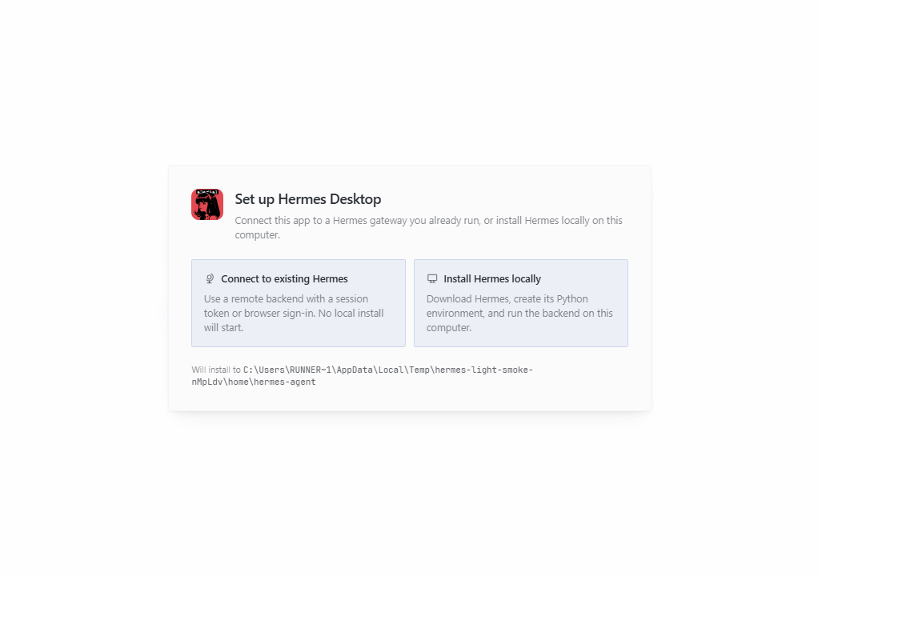

# Hermes Light 検証

## 実Windows CI

- [ビルド・起動検証](https://github.com/takano536/scoop-bucket/actions/runs/37620186448)
- 上流: `NousResearch/hermes-agent@a3ed4a173070e981332e4d879ff6cc8b9efd57ab`
- 検証ZIP: `hermes-agent-light-preview-a3ed4a1-windows-x64.zip`
- SHA256: `b83ff46eaed9e30600f7dafcb2ed69c0521bb50ff7dc925e6b5362110d325ec9`
- ZIP: 170,392,861 bytes / 1,191 entries。ダウンロード後のSHA256照合とZIP CRC検証に成功。
- Packaged Electronの起動・再起動とlocalStorage保持を検証。`payload=light`、
  `updateMechanism=external`、source commit一致、`resources/agent-payload` 非同梱を確認。
- 設定先にはCIの一時ディレクトリを使用。実gatewayや認証情報を与えていない。
- これはPR専用の検証成果物。安定版としての公開・manifest登録はしていない。

## 未確認事項と配布開始条件

最新の公開安定版 `v2026.9.24` にはLightのビルド機構がない。初回manifestは、
Light対応の安定版を実際にビルド・検証・公開できた後に生成する。
main由来のコードを過去の安定版の名前で配布しない。

上の画面には「Install Hermes locally」も表示される。Lightとしての非同梱構成と
起動は確認済みだが、リモート専用のUI/実行制約、gateway接続、接続/認証設定の
実アップグレード移行は確認できていない。表示だけからローカル動作の可否を断定しない。

- 対応安定版でのtag/claim admissionと実ビルド。
- Windows上のScoop実インストール・更新・ショートカット起動。
- gateway接続、認証・接続設定の移行、Lightのローカル動作制約。
- マージ後のReleases公開・manifest/READMEのmain書き戻し。
- 既存draftに異なるビルドの部分成果物が残った場合、上書きせず停止する。
  管理者がdraftを確認する必要がある。公開済みreleaseは書き戻し再試行時に再利用する。

これらを実行済みとみなさず、PRはDraftで保持する。
